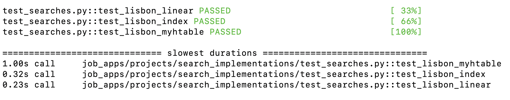

# search_implementations

This project involves comparing the difference in speeds and complexities of linear searches vs hashtable searches. Given a corpus of 100+ travel related articles, the goal is to search for a given word and return which articles contain that word. This involves searching through directories of documents, normalizing the text, and then implenting: linear search, hashtable via built-in dictionary objects, or hashtable from scratch.

Running "python -m pytest --durations=0 -v test_searches.py ~/data/berlitz1" in the CL will yield if all documents containing the words were found and the runtime of each implementation. 

